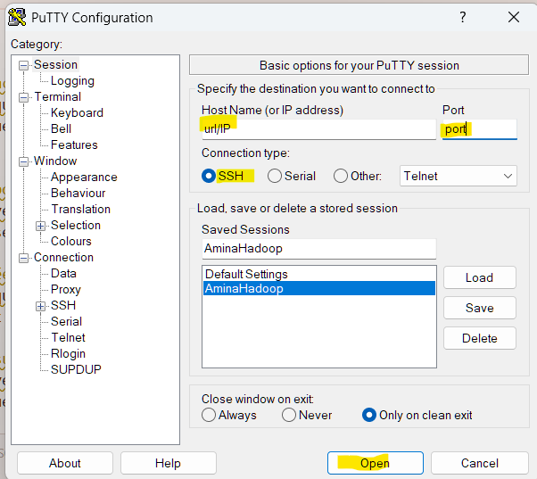
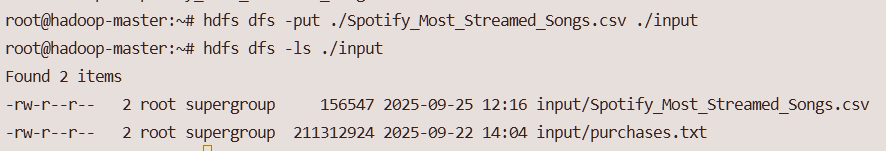
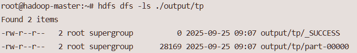
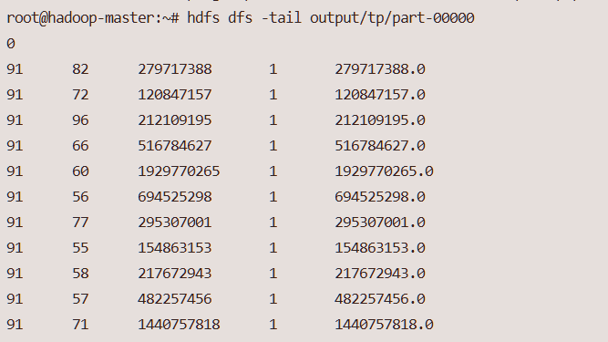
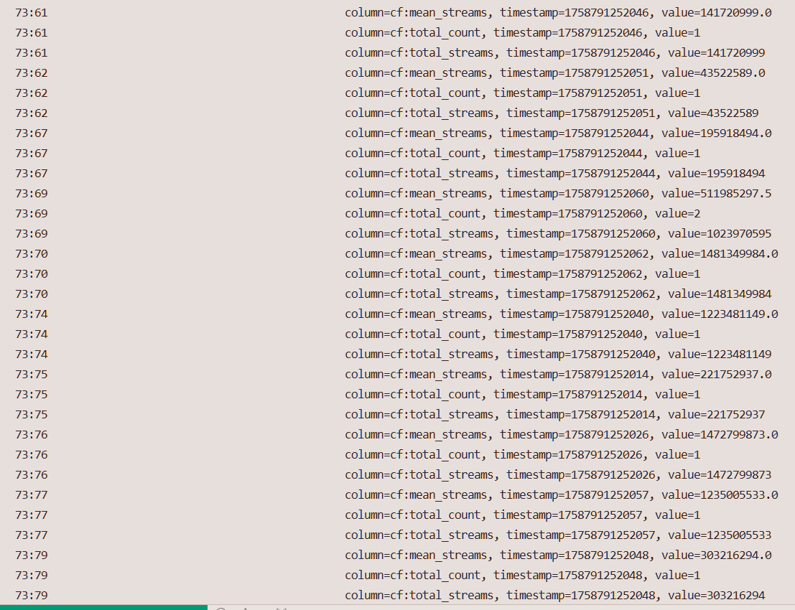

# 1. Connexion à la machine virtuelle

## 1.1 Ligne de commande :

Initialisé la connection en entrant la commande.

```bash
ssh [user_name]@[url/IP] -p [port]
```
Puis entrer le mots de pass de l'utilisateur.


## 1.2 PuTTY :

Entrer l'url/ip et le port public,
puis appuyez sur "Open".



Ensuite précisé le nom utilisateur et le mots de passe du compte auquel vous vous connecté.


# 2. Lancer les conteneurs et services Hadoop

## 2.1 Les services Hadoop nécessaires pour notre analyse

### HDFS ou Hadoop Distributed File System
C'est le système de fichiers distribué de Hadoop, donc sa couche de stockage.

Il a comme caractéristiques principales :
- d'avoir une forte tolérance aux pannes via la redondance des données
- d'être optimisé pour le traitement rapide de données volumineuses.
- de permettre le stockage et l'analyse de volumes importants de données via sa scalabilité.

### YARN ou Yet Another Resource Negotiator
C'est le gestionnaire de ressource de Hadoop.

Il permet à plusieurs application de partager les ressources d'un cluster Hadoop, en assurant une gestion efficace des ressources.

Il est composé de plusieurs élements :
- **Ressource Manager** coordonne l'utilisation des ressources du cluster
- **Node Manager** gère les ressources de chaque noeud individuel
- **Application Master** dirige l'exécution de chaque application

### Zookeeper
C'est un service pour la coordination et la gestion notamment ici du cluster HBase.

Il permet de surveiller et gérer l'état des noeuds dans un cluster. Il assure également la communication entre les différents composants et garantit la synchronisation et la cordination des actions dans un cluster. 

### HBase
C'est une base de données distribuée, open source, non relationnelle et orienté colonnes. Hbase utilise HDFS comme système de stockage, lui d'écrire et de lire des grands volumes de données.

Il est composé de deux noeuds :
- **Master** qui gère les opérations du cluster et utilise **Zookeeper** pour la coordination
- **RegionServer** qui héberge les tables HBase et gère les opérations de lecture et d'écriture

## 2.2 Liste des commandes pour lancer les conteneurs et services Hadoop
### 2.2.1

Lancer les conteneurs dockers sur la machine distante : 
```bash
./start_docker_digi.sh
```
```bash
./bash_hadoop_master.sh
```

### 2.2.2
Pour démarrer les services HDFS et YARN :
```bash
./start-hadoop.sh
```

### 2.2.3
Lancer les services HBase et Zookeeper :
```bash
start-hbase.sh
```

### 2.2.4
Enfin pour pouvoir utiliser happybase avec HBase il faut lancer la librarie Thrift:
```bash
hbase-deamon.sh start thrift
```

# 3. Importer les données dans HDFS

Pour traiter des données avec MapReduce, il faut d’abord les importé dans le hdfs.
Pour ce faire, il faut exécuter la commande:

```bash
hdfs dfs -put path_to_data target_dir_in_hdfs
```

Vous pouvez ensuite afficher le dossier cible avec:
```bash
hdfs dfs -ls target_dir_in_hdfs
```





# 4. Créer et exécuter un job MapReduce
- Expliquer la structure d'un job MapReduce (mapper, reducer)
- Donnez les commandes à exécuter pour soumettre le job sur Hadoop

# 5. Visualiser les résultats

Pour récupéré les résultat et exploiter les données, nous avons plusieurs options:
* HDFS
* HBase

## 5.1 HDFS

### 5.1.1 shell

Après un traitement MapReduce, les résultats sont généralement stockés dans un répertoire HDFS, souvent sous forme de fichiers `part-00000`, `part-00001`, etc.

Pour vérifier leur présence :

```bash
hdfs dfs -ls target_hdfs_output_dir
```


Pour afficher rapidement les dernières ligne du fichier:

```bash
hdfs dfs -tail target_hdfs_output_dir/part-00000
```



Pour lire rapidement le contenu :

```bash
hdfs dfs -cat target_hdfs_output_dir/part-00000
```

Pour les extraire en local pour une visualisation avec Pandas ou Matplotlib :

```bash
hdfs dfs -get target_hdfs_output_dir/part-00000 target_output
```

### 5.1.2 python (pydoop.hdfs)

Pour lire directement les résultats MapReduce depuis HDFS en Python :

```python
import pydoop.hdfs as hdfs

with hdfs.open('target_hdfs_output_dir/part-00000') as f:
    contenu = f.read().decode()
```

Le contenu peut ensuite être parsé ou converti en DataFrame selon le format attendu.


## 5.2 HBase

### 5.2.1 Interface en ligne de commande (CLI)

Pour interroger une table HBase via le CLI, commencez par lancer le shell :

```bash
hbase shell
```

Pour lister toutes les tables existantes dans HBase :

```bash
list
```

Utilisez la commande suivante pour afficher toutes les lignes d'une table :

```bash
scan "nom_de_la_table"
```



Chaque ligne sera affichée avec ses familles de colonnes, colonnes, timestamps et valeurs.

Vous pouvez aussi limité le nombre de résultat

```bash
scan "nom_de_la_table", {LIMIT => 10}
```

Pour afficher une ligne précise à partir de sa clé :

```bash
get "nom_de_la_table", "clé_de_ligne"
```

Pour afficher la définition d'une table (colonnes, familles, etc.) :

```bash
describe "nom_de_la_table"
```

### 5.2.1 python (happybase)

Pour interagir avec HBase en Python, on peut utiliser la bibliothèque `happybase`, qui permet de se connecter à HBase via Thrift.

Exemple de récupération des données depuis une table nommée `dance_energy_stats` :

Ce script établit une connexion avec le serveur HBase et de récupéré la table voulu.
```python
try:
    connection = happybase.Connection('hadoop-master')
    table = connection.table('dance_energy_stats')
except Exception as e:
    print("Connetion error: {0}".format(e), file=sys.stderr)
    sys.exit(1)
```

Ce script scanne la table ligne par ligne, extrait la valeur de la colonne `cf:mean_streams`, et stocke les résultats dans une liste Python.
```python
data = []
for key, row in table.scan():
    try:
        mean_streams = float(row[b'cf:mean_streams'])
        key = key.decode()
        data.append((key, mean_streams))
    except Exception as e:
        print('Parsing error: {0}'.format(e))

connection.close()
```


# 6.Récupérer les résultats
- Expliquez comment récupérer les fichiers de sortie du job MapReduce depuis HDFS pour le mettre sur la partie linux de votre container hadoop-master.
- Donnez la procédure pour récupérer les données du container jusque son pc local.