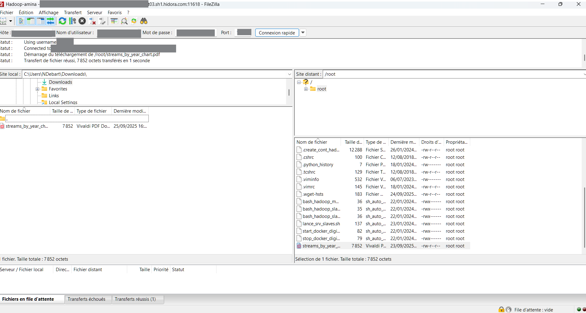
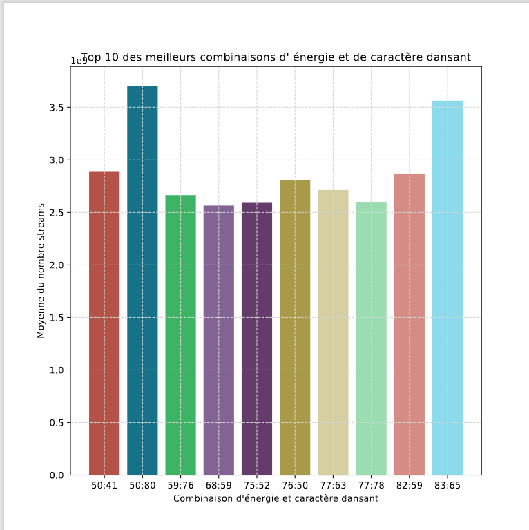

# 1. Connexion à la machine virtuelle

## 1.1 Ligne de commande :

Initialisé la connection en entrant la commande.

```bash
ssh [user_name]@[url/IP] -p [port]
```

Puis entrer le mots de pass de l'utilisateur.


## 1.2 PuTTY :

Entrer l'url/ip et le port public,
puis appuyez sur "Open".


Ensuite précisé le nom utilisateur et le mots de passe du compte auquel vous vous connecté.


# 2. Lancer les conteneurs et services Hadoop

## 2.1 Les services Hadoop nécessaires pour notre analyse

### HDFS ou Hadoop Distributed File System

C'est le système de fichiers distribué de Hadoop, donc sa couche de stockage.

Il a comme caractéristiques principales :

- d'avoir une forte tolérance aux pannes via la redondance des données
- d'être optimisé pour le traitement rapide de données volumineuses.
- de permettre le stockage et l'analyse de volumes importants de données via sa scalabilité.

### YARN ou Yet Another Resource Negotiator

C'est le gestionnaire de ressource de Hadoop.

Il permet à plusieurs application de partager les ressources d'un cluster Hadoop, en assurant une gestion efficace des ressources.

Il est composé de plusieurs éléments :

- **Ressource Manager** coordonne l'utilisation des ressources du cluster
- **Node Manager** gère les ressources de chaque noeud individuel
- **Application Master** dirige l'exécution de chaque application

### Zookeeper

C'est un service pour la coordination et la gestion notamment ici du cluster HBase.

Il permet de surveiller et gérer l'état des noeuds dans un cluster. Il assure également la communication entre les différents composants et garantit la synchronisation et la coordination des actions dans un cluster.

### HBase

C'est une base de données distribuée, open source, non relationnelle et orienté colonnes. Hbase utilise HDFS comme système de stockage, lui d'écrire et de lire des grands volumes de données.

Il est composé de deux noeuds :

- **Master** qui gère les opérations du cluster et utilise **Zookeeper** pour la coordination
- **RegionServer** qui héberge les tables HBase et gère les opérations de lecture et d'écriture

## 2.2 Liste des commandes pour lancer les conteneurs et services Hadoop

### 2.2.1

Lancer les conteneurs dockers sur la machine distante : 

```bash
./start_docker_digi.sh
```

```bash
./bash_hadoop_master.sh
```

### 2.2.2

Pour démarrer les services HDFS et YARN :

```bash
./start-hadoop.sh
```

### 2.2.3

Lancer les services HBase et Zookeeper :

```bash
start-hbase.sh
```

### 2.2.4

Enfin pour pouvoir utiliser happybase avec HBase il faut lancer la librarie Thrift:

```bash
hbase-deamon.sh start thrift
```

# 3. Importer les données dans HDFS

Pour traiter des données avec MapReduce, il faut d’abord les importé dans le hdfs.
Pour ce faire, il faut exécuter la commande:

```bash
hdfs dfs -put path_to_data target_dir_in_hdfs
```

Vous pouvez ensuite afficher le dossier cible avec:
```bash
hdfs dfs -ls target_dir_in_hdfs
```


# 4. Créer et exécuter un job MapReduce

## 4.1 Structure d'un job MapReduce

Un job MapReduce est composée de plusieurs parties : le mapper, le sorting et le reducer.

### 4.1.1 Le mapper

C'est un script qui permet de sélectionner les données désirées en leur associant des clefs par un système de clef-valeur. La clef peut être composée.

Exemple de script mapper en python :

```python
import pandas as pd
import sys
import logging
 
logging.basicConfig(filename='debug.log',level=logging.DEBUG)
logging.debug("Entering mapper.py")

name_column = ["track_name","artist(s)_name","artist_count","released_year","released_month","released_day","in_spotify_playlists","in_spotify_charts","streams","in_apple_playlists","in_apple_charts","in_deezer_playlists","in_deezer_charts","in_shazam_charts","bpm","key","mode","danceability_%","valence_%","energy_%","acousticness_%","instrumentalness_%","liveness_%","speechiness_%","cover_url"]
df = pd.read_csv(sys.stdin, engine = "python", header = None, names = name_column)

for index, row in df.iterrows():
   print("%s\t%s\t%s" %(row["danceability_%"], row["energy_%"], row["streams"]))
```

Ici trois données sont : danceability_%, energy_% et streams. Les deux premières données nous servirons de clef pour la suite du MapReduce.

### 4.1.2 Le sorting

C'est l'étape après le mapper qui permet de rassembles les clefs identiques entre elles.

### 4.1.3 Le reducer

C'est la dernière étape du MapReduce. Ce script agrège les données entre elles lorsqu'elles possèdent des clefs identiques. C'est également l'étapes ou des opérations sur les données peuvent être réaliser comme leur soustractions, leur additions ou le calcul de leur moyenne. Enfin il peut être précisé dans le script comment stocker les résultats finaux, par exemple sur une base de données comme HBase.

Exemple de script reducer en python avec sauvegarde des données dans HBase :

#### Connexion au serveur HBase et création de la table dance_energy_stats

```python
#!/usr/bin/env python3
import sys
import happybase

try:
    connection = happybase.Connection('hadoop-master')
    tables = connection.tables()

    if b'dance_energy_stats' not in tables:
        connection.create_table('dance_energy_stats', {'cf': dict()})
    table = connection.table('dance_energy_stats')
except Exception as e:
    print("HBase connection error: {0}".format(e), file=sys.stderr)
    sys.exit(1)
```

#### Recuperation et transformation des données puis sauvegarde dans HBase

```python
current_danceability = None
current_energy = None
total_streams = 0
total_count = 0

try:
    for line in sys.stdin:
        parts = line.strip().split('\t')
        if len(parts) != 3:
            continue  # skip malformed lines

        danceability, energy, streams = parts
        try:
            streams = int(streams)
        except ValueError:
            continue  # skip lines with non-integer stream values

        if (current_danceability == danceability) and (current_energy == energy):
            total_streams += streams
            total_count += 1
        else:
            if current_danceability is not None and current_energy is not None:
                row_key = "{}:{}".format(current_danceability, current_energy).encode()
                table.put(row_key, {
                    b'cf:total_streams': str(total_streams).encode(),
                    b'cf:total_count': str(total_count).encode(),
                    b'cf:mean_streams':str(total_streams/total_count).encode()
                })
                print("{0}\t{1}\t{2}\t{3}\t{4}".format(current_danceability, current_energy, total_streams, total_count,total_streams/total_count ))

            current_danceability = danceability
            current_energy = energy
            total_streams = streams
            total_count = 1

    # Final flush
    if current_danceability is not None and current_energy is not None:
        row_key = "{}:{}".format(current_danceability, current_energy).encode()
        table.put(row_key, {
            b'cf:total_streams': str(total_streams).encode(),
            b'cf:total_count': str(total_count).encode(),
            b'cf:mean_streams':str(total_streams/total_count).encode()
        })
        print("{0}\t{1}\t{2}\t{3}\t{4}".format(current_danceability, current_energy, total_streams, total_count,total_streams/total_count ))

except Exception as e:
    print("Processing error: {0}".format(e), file=sys.stderr)
    sys.exit(1)
finally:
    connection.close()
```

Ici les données récupérées sont : danceability, energy et streams.\
Danceability et energy sont utilisées comme paire de clefs dans la table de HBase. Les données de streams sont additionnées entre elles quand leurs clefs sont identiques et leur moyenne est calculées.\
Ensuite toutes ces données sont ajoutées dans la table dance_energy_stats dans HBase.\
Pour finir la connection à la base de données est fermée.

## 4.2 Les commandes à exécuter pour soumettre le job sur Hadoop

Dans un premier temps il faut créer le dossier input qui contiendra les fichiers d'entrées pour le MapReduce :

```bash
hdfs dfs -mkdir /user/input
```

Ensuite il faut vérifier que le dossier de sortie (output) du MapReduce n'existe pas avant de le créer (car si le dossier existe et contient des données MapReduce ne voudra pas se lancer)

```bash
hdfs dfs --rm -r /user/output
hdfs dfs -mkdir /user/output
```

Enfin il reste à lancer la commande pour le MapReduce :

```bash
hadoop jar $HADOOP_HOME/share/hadoop/tools/lib/hadoop-streaming-2.7.2.jar -file /root/mapper.py-mapper "python3 mapper.py" -file /root/reducer.py -reducer "python3 reducer.py" -input /user/root/input/Spotify_Most_Streamed_Songs.csv -output /user/root/output/streams
```

# 5. Visualiser les résultats

Pour récupéré les résultat et exploiter les données, nous avons plusieurs options:
* HDFS
* HBase

## 5.1 HDFS

### 5.1.1 shell

Après un traitement MapReduce, les résultats sont généralement stockés dans un répertoire HDFS, souvent sous forme de fichiers `part-00000`, `part-00001`, etc.

Pour vérifier leur présence :

```bash
hdfs dfs -ls target_hdfs_output_dir
```


Pour afficher rapidement les dernières ligne du fichier:

```bash
hdfs dfs -tail target_hdfs_output_dir/part-00000
```


Pour lire rapidement le contenu :

```bash
hdfs dfs -cat target_hdfs_output_dir/part-00000
```

Pour les extraire en local pour une visualisation avec Pandas ou Matplotlib :

```bash
hdfs dfs -get target_hdfs_output_dir/part-00000 target_output
```

### 5.1.2 python (pydoop.hdfs)

Pour lire directement les résultats MapReduce depuis HDFS en Python :

```python
import pydoop.hdfs as hdfs

with hdfs.open('target_hdfs_output_dir/part-00000') as f:
    contenu = f.read().decode()
```

Le contenu peut ensuite être parsé ou converti en DataFrame selon le format attendu.


## 5.2 HBase

### 5.2.1 Interface en ligne de commande (CLI)

Pour interroger une table HBase via le CLI, commencez par lancer le shell :

```bash
hbase shell
```

Pour lister toutes les tables existantes dans HBase :

```bash
list
```

Utilisez la commande suivante pour afficher toutes les lignes d'une table :

```bash
scan "nom_de_la_table"
```


Chaque ligne sera affichée avec ses familles de colonnes, colonnes, timestamps et valeurs.

Vous pouvez aussi limité le nombre de résultat

```bash
scan "nom_de_la_table", {LIMIT => 10}
```

Pour afficher une ligne précise à partir de sa clé :

```bash
get "nom_de_la_table", "clé_de_ligne"
```

Pour afficher la définition d'une table (colonnes, familles, etc.) :

```bash
describe "nom_de_la_table"
```

### 5.2.1 python (happybase)

Pour interagir avec HBase en Python, on peut utiliser la bibliothèque `happybase`, qui permet de se connecter à HBase via Thrift.

Exemple de récupération des données depuis une table nommée `dance_energy_stats` :

Ce script établit une connexion avec le serveur HBase et de récupéré la table voulu.
```python
try:
    connection = happybase.Connection('hadoop-master')
    table = connection.table('dance_energy_stats')
except Exception as e:
    print("Connetion error: {0}".format(e), file=sys.stderr)
    sys.exit(1)
```

Ce script scanne la table ligne par ligne, extrait la valeur de la colonne `cf:mean_streams`, et stocke les résultats dans une liste Python.
```python
data = []
for key, row in table.scan():
    try:
        mean_streams = float(row[b'cf:mean_streams'])
        key = key.decode()
        data.append((key, mean_streams))
    except Exception as e:
        print('Parsing error: {0}'.format(e))

connection.close()
```


# 6.Récupérer les résultats

## 6.1 Récupérer les fichiers depuis le HDFS pour les transferer en local

La commande pour récupérer les fichiers de sortie du job MapReduce depuis le HDFS pour le mettre dans le container hadoop-master :

```bash
hdfs dfs -copyToLocal hdfs_input_file_path output_path
```

- Donnez la procédure pour récupérer les données du container jusque son pc local.

## 6.1 Procédure pour récupérer les données du container jusque son pc local

Dans un premier temps, les données que l'on souhaite récupérer doivent être déplacer dans le dossier /datavolume1/ avec la commande suivante :

```bash
mv path_to_data /datavolume1/name_file
```

Ensuite en utilisant filezila il sera possible en cherchant dans l’arborescence du container de trouver le fichier et de le copier vers son pc local.

Le chemin pour retrouver les fichiers déposer dans le /datavolume1/ est :

```bash
/var/lib/docker/volumes/digi01/_data
```

Exemple de connexion au serveur distant via filezila.


# 7. Analyse des résultat.



Pour la grande majorité du top 10, on observe une énergie et/ou une caractéristique dansante élevées.

Cela pourrait indiquer une relation potentielle entre ces caractéristiques et le nombre moyen de vues par œuvre.

Cependant, tirer une conclusion uniquement à partir des données du top 10 serait prématuré. Une analyse plus approfondie, basée sur un ensemble de données plus large, serait à envisager.

Par ailleurs, la présence de la barre 50:41 dans le top 5, malgré des niveaux d’énergie et de caractère dansant globalement plus faibles que ses pairs, pourrait indiquer :

- une donné aberrante(non reproductible),
- des données incomplètes ou peu fiable
- ou encore que d’autres caractéristiques influencent le nombre de vues.


---

Debart Nathan

Guidoux Bluwen
